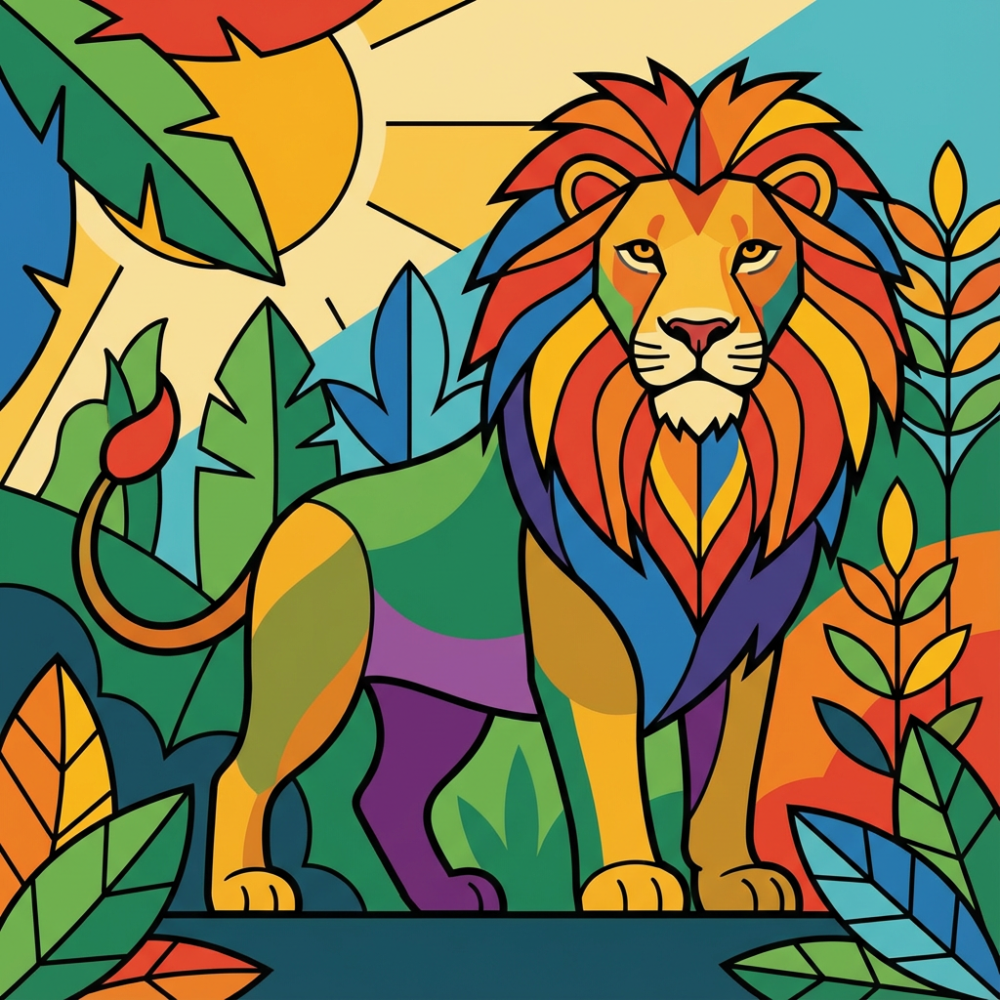

# Image Generation API

Turn text into images. Transform photos into art.

| Illustration | → Photograph |
|--------------|--------------|
|  |  |

---

## Setup

```bash
bun install && cp .env.local.example .env.local
# Add your keys to .env.local, then:
bun run dev
```

```bash
# Set these for the examples below
export IMAGE_API_KEY="your-key"
export API_URL="http://localhost:3000"  # or your Vercel URL
```

---

## API

**`POST /api/generate`**

| Parameter | Type | Required | Description |
|-----------|------|----------|-------------|
| `prompt` | string | ✅ | What to generate |
| `model` | string | | Which AI model (see below) |
| `referenceImage` | string | | Base64 image to transform |

### Models

| Model | Speed | Quality | |
|-------|-------|---------|---|
| `google/gemini-3-pro-image` | ⚡⚡ | ⭐⭐⭐⭐⭐ | **Default** (Nano Banana Pro) |
| `google/gemini-2.5-flash-image` | ⚡⚡⚡ | ⭐⭐⭐⭐ | Fast |
| `google/gemini-2.5-pro-image` | ⚡⚡ | ⭐⭐⭐⭐⭐ | Detailed |

---

## Examples

### Generate an image

```bash
curl -s -X POST $API_URL/api/generate \
  -H "Content-Type: application/json" \
  -H "Authorization: Bearer $IMAGE_API_KEY" \
  -d '{"prompt": "A sunset over mountains"}' \
  | jq -r '.images[0].base64' | base64 -d > sunset.png
```

### Use a faster model

```bash
curl -s -X POST $API_URL/api/generate \
  -H "Content-Type: application/json" \
  -H "Authorization: Bearer $IMAGE_API_KEY" \
  -d '{"prompt": "A robot", "model": "google/gemini-2.5-flash-image"}' \
  | jq -r '.images[0].base64' | base64 -d > robot.png
```

### Transform an image

```bash
curl -s -X POST $API_URL/api/generate \
  -H "Content-Type: application/json" \
  -H "Authorization: Bearer $IMAGE_API_KEY" \
  -d "{\"prompt\": \"Make this a pencil sketch\", \"referenceImage\": \"$(base64 -i photo.png)\"}" \
  | jq -r '.images[0].base64' | base64 -d > sketch.png
```

---

## Response

```json
{"images": [{"base64": "iVBORw0KGgo...", "mediaType": "image/png"}]}
```

| Status | Meaning |
|--------|---------|
| `200` | Success |
| `400` | Bad prompt |
| `401` | Bad API key |
| `500` | Generation failed |

---

## Prompt Tips

| Do | Don't |
|----|-------|
| "A golden retriever in a sunny park" | "A dog" |
| "...watercolor style" | (no style) |
| "...square 1:1" | (random aspect ratio) |
| "...soft morning light" | (no lighting) |

---

## Environment

| Variable | Description |
|----------|-------------|
| `AI_GATEWAY_API_KEY` | Vercel AI Gateway key |
| `IMAGE_API_KEY` | Your API key for auth |

---

**Stack:** Next.js 16 · Bun · Turbopack · Vercel AI Gateway
